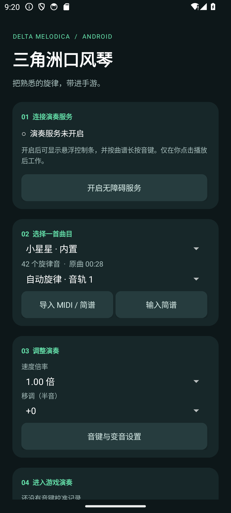

# 三角洲口风琴 · 安卓预览版

安卓端独立工程，面向 Android 8.0 及以上。通过用户开启的无障碍服务发送触摸手势，无需 Root。当前为功能原型，不能将模拟器结果当作三角洲手游兼容性结论。

## 使用

1. 安装 APK，打开「三角洲口风琴」，阅读权限说明并进入系统无障碍设置，手动开启「三角洲口风琴 · 演奏服务」。
2. 选择内置《小星星》，或导入 `.mid`／`.midi`、UTF-8 文本简谱，也可直接输入简谱保存。MIDI 可选择自动旋律、指定音轨或全部音轨高声部。
3. 设置速度和移调，点击「显示悬浮控制条」。进入三角洲手游的口风琴演奏画面。
4. 点悬浮窗「校准」，依次点 **1、2、3、4、5、6、7、高音 1、半音、升调、自然音、降调** 的中心，共 12 处。校准层只记录位置，不会将这些点击传给游戏。校准同时绑定当前应用、屏幕尺寸和旋转方向。
5. 将悬浮窗拖到不遮挡这 12 个按钮的位置。点「播放」，按游戏当前状态选择半音「未选中」或「已选中」，倒计时 3 秒后演奏。「暂停」保留位置；「继续」也需确认半音当前状态，再从该处续播；「停止」回到曲首。
6. 收起悬浮窗会停止演奏，可返回主界面恢复。彻底退出演奏服务可点主界面「停止并关闭演奏服务」，或在系统无障碍设置中关闭。

升级 v0.2 后保留曲库，但旧校准不再用于演奏，需要重新完成 12 点校准。可以先在「本地测试键盘」检查触摸和选中状态；进入真实游戏后需重新校准。更换分辨率、屏幕方向或游戏键位后也应重新校准。

## 音高和时序范围

- 默认中央 1 = MIDI 60（C4），需按游戏实际音高校正。
- 升调、自然音、降调是点击后保持选中的三选一音区；半音是独立开关，可以与任意音区组合。自然音只切回中央音区，不会取消半音。
- 沿用音高映射：升调高一个八度、降调低一个八度、半音升半音，超出总音域的音按八度折回。程序先松开音键，再依次点击需要改变的音区／半音按钮，最后按住音键；状态相同时不重复点击。
- 半音没有独立的「关闭」按钮，因此每次开始、续播都需要用户确认它的实际选中状态；程序随后明确点击所需音区。暂停、停止、切出或手势中断会作废内部状态记录，不会盲目尝试复位半音。手动调整游戏变音前请先暂停。
- 变音按钮每次点击 45 毫秒，完成后留 20 毫秒供界面响应，实际耗时受系统调度影响。切换期间暂停乐谱计时，避免短音被吞掉；变音频繁的曲目会增加短暂停顿，实际演奏耗时可能长于曲谱显示时长。
- 简谱支持 `1 2 3:2 0 +1 -5 #4`；冒号后为拍数，支持 `:1/2`，文本文件默认 100 BPM。
- MIDI 支持 PPQ 时间格式的 0／1 型、跨轨速度表、打击乐过滤与高声部整理；不支持 SMPTE、类型 2、踏板还原和完整多声部。它是安卓第一版实现，尚未完整移植桌面版的钢琴连奏、片段编排和线上曲库。
- 调速和移调在主界面设置，应用后回到曲首。悬浮窗提供播放、暂停、继续、停止、校准和收起。
- 曲谱最长 30 分钟、最多 30000 音符，MIDI 文件最大 10 MB。导入保存本地副本，不修改原文件。

## 输入保护与本机数据

手势只在校准的目标应用处于前台、屏幕解锁且尺寸和方向一致时开始。切出、锁屏、旋转或系统取消手势会暂停。音符按不超过 60 毫秒的片段连续长按，暂停或停止后在当前短段回调时释放；系统调度可能增加延迟，不能承诺固定上限。接口拒绝或回调超时会关闭服务，由系统清理该服务的触摸序列。

为避免系统将静止的续接手势合并为空事件，长按在音键中心附近往返 1 个屏幕像素；校准时应点按钮中心，避免边缘。点击悬浮暂停按钮时，系统可能先取消当前手势，助手会保留暂停状态。

窗口包名仅用于前台确认。不读取窗口文字、不截图、无网络权限，不进行游戏进程读取或修改。曲库和校准保存在应用私有目录；卸载会移除。测试键盘校准不会用于游戏窗口，返回主界面也不会触发测试音键。

## 构建与验证

使用 Android Studio 自带的 JDK 21，安装 Android SDK Platform 34 与 Build Tools 36.0.0。设置 `JAVA_HOME` 和 `ANDROID_HOME`，或在本目录不入库的 `local.properties` 中指定 `sdk.dir`。

```powershell
.\build.ps1 -JavaHome '你的 JDK 21 目录' -SdkRoot '你的 Android SDK 目录'
```

项目固定 Gradle 9.2.1 和 Android Gradle Plugin 9.0.1。Java 源码采用 UTF-8；Gradle 进程采用 `file.encoding=COMPAT`，使 Windows 中文路径的测试进程参数文件与系统编码一致。APK 位于 `app\build\outputs\apk\debug\app-debug.apk`，为本地测试签名的预览包。

构建脚本先执行 `clean testDebugUnitTest assembleDebug lintDebug`，成功后复制到仓库根目录 `dist\三角洲口风琴_安卓_v0.2预览版.apk`，并输出 SHA-256。使用完整清理构建，避免增量打包残留旧 dex。

13 项核心测试覆盖简谱、MIDI、旋律整理、音高映射、暂停续播、倒计时取消，以及互斥音区／独立半音、状态失效和切换期间的时钟保持。

设备触摸回归需要专用 Android 10+ 测试设备或模拟器，先安装应用并开启本应用的无障碍服务：

```powershell
.\gradlew.bat assembleDebugAndroidTest
adb -s 你的测试设备序列号 install -r .\app\build\outputs\apk\androidTest\debug\app-debug-androidTest.apk
adb -s 你的测试设备序列号 shell am instrument -w -r top.aiygzn.melodica.test/top.aiygzn.melodica.GestureSmokeTest
```

此入口会打开应用自建测试键盘，临时校准并执行触摸，结束后恢复曲库选择和校准设置。它不会进入三角洲手游；只重连原本已开启的本应用无障碍服务。成功时输出各项「通过」和 `INSTRUMENTATION_CODE: -1`；仅 adb 返回码为 0 不能判断测试成功。普通 `uiautomator dump` 会暂时抑制其他无障碍服务，不应在演奏过程中用它验证状态。

13 项设备回归包含真实 12 点校准、旧校准失效、半音确认前不发键、长音与重复音、暂停／续播／停止、倒计时取消、三音区与半音组合、半音初始已选中、变音点击途中暂停后的状态同步、密集短音、目标应用与旋转检查、切出释放。仅该测试入口保存自建界面的截图，正常演奏不截图。




## 平台接口依据

- [Android 无障碍手势接口](https://developer.android.com/reference/android/accessibilityservice/AccessibilityService#dispatchGesture(android.accessibilityservice.GestureDescription,android.accessibilityservice.AccessibilityService.GestureResultCallback,android.os.Handler))
- [连续长按手势](https://developer.android.com/reference/android/accessibilityservice/GestureDescription.StrokeDescription#continueStroke(android.graphics.Path,long,long,boolean))
- [无障碍悬浮窗](https://developer.android.com/reference/android/view/WindowManager.LayoutParams#TYPE_ACCESSIBILITY_OVERLAY)

真机待验证：手游对按钮点击时长及切换间隔的响应、中央音高和八度映射、长音听感、密集音符稳定性，以及不同手机系统的后台行为。选中与互斥规则按用户提供的手游画面和说明实现。
