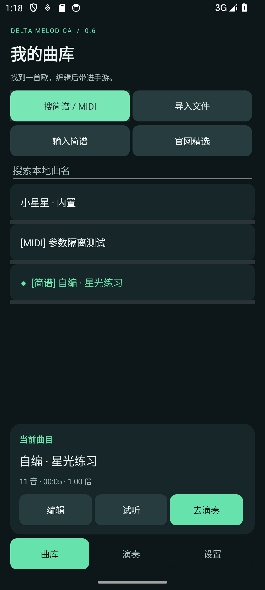
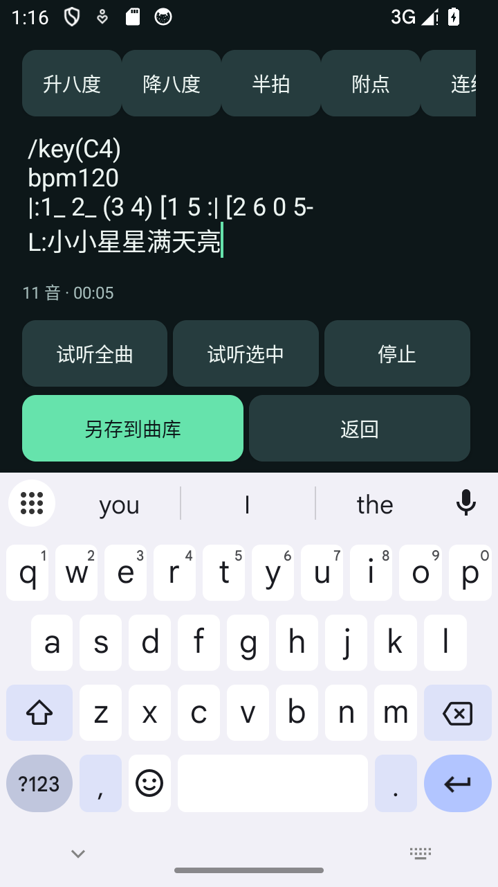

# 三角洲口风琴 · 安卓 0.6 预览版

Android 8.0+，无需 Root。本版同步近期桌面版的搜索、编辑、原谱规则和曲目设置，并优化手机布局。

## 本版功能

- **三页导航**：曲库、演奏、设置。本地曲名筛选、来源标记、当前曲目卡片，以及搜索、导入、编辑和试听入口。竖屏单列，横屏并排，按钮随字体增高。
- **五来源聚合搜索**：简谱空间、官网曲库、BitMidi、MidiWorld、MidiShow，默认全选；支持繁简体匹配、逐站返回、加载更多、取消与源站浏览器入口。区分无结果、网络错误和人机验证。
- **全屏乐曲编辑**：MIDI、输入简谱、内置与云端曲谱均可编辑。精确音符／原谱格式、常用符号、调号、速度、移调、撤销／重做、全曲／选段试听与另存修改版。原曲保留，未保存返回时提示，旋转保留草稿和选区。默认先展示完整编辑页；点输入后收起说明区，给软键盘上方的谱文和保存按钮留出空间。搜索页也适配键盘。
- **原谱与谱面**：保留原文、歌词、来源和解析模式；点谱面定位文字。竖屏切换，横屏左右并排。试听按实际音频位置高亮和滚动，反复回到原音符；每页最多 128 个符号，支持手动与自动翻页。
- **每曲设置**：原谱分音／钢琴适配连奏，0.25～2 倍速、±24 半音移调，自动／指定／全部音轨。速度、移调、音轨、方式和片段按游客／账号分别保存；改参数会停止并回到曲首。
- **片段编排与定位**：按原曲秒数添加、更新、排序、删除、重复或清空。最多 100 段，每段重复 1～20 次。悬浮窗拖动进度后暂停并释放旧触摸，继续前重新确认半音状态。
- **账号修正**：退出仍可查看原游客曲库，归属记录防止另一账号重复继承。合并时复制已有每曲设置，之后彼此独立。登录／注册／找回切换保留邮箱、清空密码和验证码；重置后返回登录页。
- **导入兼容**：MIDI、UTF-8 文本、桌面／官网曲谱 JSON，官网精选也支持 MIDI 与 JSON。原谱元数据与音符一致才恢复为原谱编辑，过期信息不覆盖实际音符。

## 使用

1. 在「曲库」搜索下载，或导入文件、输入简谱。选中曲目后可试听、编辑并另存。本机合成音试听不会向游戏发送触摸。
2. 在「演奏」选择音轨、方式、速度、移调或片段。需要无障碍授权时会提供系统入口，也可在「设置」管理。
3. 显示悬浮控制条，进入手游口风琴画面，依次校准 **1、2、3、4、5、6、7、高音 1、半音、升调、自然音、降调**，共 12 处。校准点击不穿透游戏。
4. 移开遮挡音键的悬浮窗，点播放并如实确认半音当前状态。倒计时预选变音，首次 3 秒后按音键。
5. 暂停保留位置，继续前再次确认半音；停止归零，拖动进度后保持暂停。倒计时／播放期间收起禁用，释放触摸后恢复。
6. 日常「停止并隐藏悬浮窗」保留已有授权；主动撤销需进入系统设置。

已有曲库和 v0.2 以后的 12 点校准可继续使用。屏幕方向、分辨率、键位或目标应用改变后重新校准。「设置 → 打开本地测试键盘」可检查触摸，测试键盘校准不会用于游戏。

## 记谱与当前范围

精确格式以空格分隔，冒号后为拍数，支持分数／小数，重复加减号表示多个八度：

    1 2 3:2 0 +1 -5 #4
    (1 1 2) 0:1/2 ++1

MIDI 转换以 120 BPM 表示精确拍数，保留变速、长音和休止；括号只表示连奏，重复音独立起音，时间精度为毫秒。

原谱示例：

    /key(A3)
    bpm108
    |:1_ 2_ (3 4) [1 5 :| [2 6 0 5-
    L:小小星星满天亮

支持八度点、升降音、附点、减时符号、延音、小节、反复、一二房子、段落调号及歌词相对转调。未标速度部分按 120 BPM，未标调号部分按 1=C4，并提示默认值。

反复最多嵌套 8 层，回跳恢复段首速度、调号、歌词转调，一房子的变化不带入第二遍。同音圆括号／波浪延音线合并为一次起音，不同音高圆括号按连奏处理。选段从完整时间轴裁切，保留上下文和反复中的各次出现，须选中完整音符。

「跟随源站播放」沿用桌面已核对的差异：忽略反复与连线，最后一个调号用于全曲，房子数字可能成为音符。两种模式独立保存。暂不支持 D.C.／D.S.、更多房子、专用连音组、装饰音及跨反复边界连线，未知语法阻止导入。

谱面是辅助编辑预览，结构标记使用紧凑文字，尚非印刷级制谱，不支持拖拽音符。图片／PDF 简谱识别、音频自动扒谱未包含在此版。

## 网络与数据

公开 MIDI／文字谱可下载；MidiShow 在浏览器验证并按源站账号／积分规则下载后导入。程序不代登录或自动完成人机验证。

网页最大 2 MB，官网目录 1 MB、500 首，MIDI 10 MB，官网 JSON 2 MB。仅接受 HTTPS，限制超时和重定向，校验目录提供的大小与 SHA-256 后才保存。同一官网下载固定标识，聚合 MIDI 按内容摘要去重，简谱按来源、原文和模式保存。退出或新搜索使旧回调失效，失败不留下半首曲目。

游客可离线导入、编辑、试听、演奏。注册继承／主动同步才上传私有云端，账号与官网、Windows 共用；会话用 Android Keystore 加密，密码不落盘。云端仅同步标准音符、时值和音轨，原文、局部连奏、速度、移调、片段和校准留在本机。卸载移除本机数据，云端曲库保留。

## 输入保护

只在校准目标应用处于前台、屏幕解锁且尺寸／方向一致时发手势；切出、锁屏、旋转或系统取消手势时暂停并作废变音状态。先释放音键，再切换音区／半音，再按音键，相同已知状态不重复切换。

升调／自然音／降调三选一，半音独立。中央 1 默认 MIDI 60，超音域仅按八度折回。手动改变音前应暂停。长音按不超过 60 毫秒的片段续接，实际释放延迟受系统调度影响；接口拒绝或超时则关闭服务，由系统清理触摸。

保留倒计时及空隙提前变音；切换超过下一音时刻时暂缓乐谱时钟，避免吞短音，密集变音可能长于显示时长。曲谱／编排仍限 30 分钟、30000 音符。MIDI 支持 PPQ 0／1 型、跨轨速度和打击乐过滤，不支持 SMPTE、类型 2、踏板还原或完整多声部。

不读取游戏文字、不截图游戏、不读写游戏进程。验证截图来自专用模拟器自建界面；模拟器通过不代替手游真机验证。

## 构建与验证

需要 Android Studio JDK 21、SDK Platform 34、Build Tools 36.0.0。固定 Gradle 9.2.1、AGP 9.0.1，附加依赖见 [third_party/README.md](third_party/README.md)。

    .\build.ps1 -JavaHome '你的 JDK 21 目录' -SdkRoot '你的 Android SDK 目录'

脚本 clean 后运行单元测试、assembleDebug、lintDebug，输出仓库根目录 dist\三角洲口风琴_安卓_v0.6预览版.apk 和 SHA-256。使用本机测试签名，可覆盖既有同签名预览版。

    python .\tools\generate_parity_fixtures.py
    .\gradlew.bat testDebugUnitTest
    .\gradlew.bat assembleDebug assembleDebugAndroidTest '-PtestRunner=top.aiygzn.melodica.FeatureChecks'
    adb -s 测试设备序列号 install -r .\app\build\outputs\apk\debug\app-debug.apk
    adb -s 测试设备序列号 install -r .\app\build\outputs\apk\androidTest\debug\app-debug-androidTest.apk
    adb -s 测试设备序列号 shell am instrument -w -r top.aiygzn.melodica.test/top.aiygzn.melodica.FeatureChecks

账号测试入口为 AccountChecks，使用隔离目录及假服务、不发邮件。默认 GestureSmokeTest 需要专用设备预先开启本应用无障碍，支持 suite=permissions、online、timing；切换入口后重新安装测试 APK。成功须有各项通过和 INSTRUMENTATION_CODE: -1，不能只看 adb 返回码。

可选聚合联网检查：设置 MELODICA_LIVE_SEARCH=1 后运行 ResourceSearchTest，常规单元测试不依赖网络。代码在 codex/android-feature-sync 分阶段提交；本地 pre-push 保护按此前要求拦截安卓推送，本轮未绕过。详见 [验证记录.md](../验证记录.md)。
