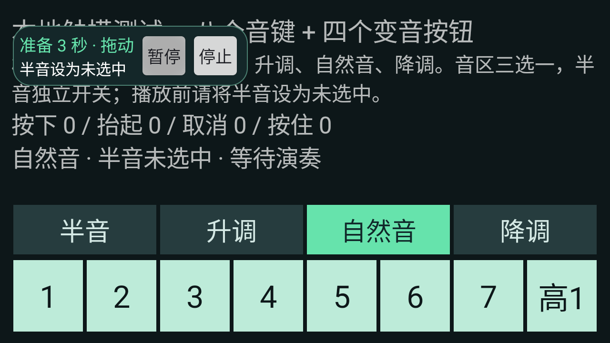

# 三角洲口风琴 · 安卓版

## v0.6.3 半音纯文字提示（已发布）

2026-09-14 已上线：[安卓官网下载](https://aiygzn.top/melodica/android.html)。本地成品为 `dist/delta-melodica-android-v0.6.3.apk`，沿用正式签名，可覆盖升级 v0.6.0 及以上正式包并保留曲库、设置与校准。公网下载及校验通过，详见[发布记录](../docs/android-v0.6.3-release.md)。

点击「播放」或「继续」后，小控制条内只短暂显示「半音设为未选中」。3 秒后文字自动换回播放进度并开始演奏，不再显示「开始演奏」「取消」或半音状态选择按钮，不弹窗、不展开额外提示区。准备期间不会发送音键或变音手势；需要中止时可点现有「暂停」「停止」，隐藏窗口或切出目标画面也会取消等待中的演奏。

28 项单元测试、15 项完整触摸回归及小屏大字体布局检查通过；仅使用 Android 14 模拟器自建键盘，未进行手游真机测试。

## v0.6.2 半音关闭提示（历史本地更新包）

本地更新包为 `dist/delta-melodica-android-v0.6.2.apk`，可覆盖升级 v0.6.0／v0.6.1 正式签名安装包。此阶段未发布到官网，以下交互已被 v0.6.3 替代。

播放和续播前不再选择「已选中／未选中」，统一提示「请先将游戏内『半音』设为未选中」。在游戏中手动关闭半音后，点「开始演奏」；不准备演奏时点「取消」。程序从半音关闭状态开始，随后按曲谱切换半音和音区。自适应悬浮窗与播放时自动精简继续保留。

28 项单元测试、15 项完整触摸回归通过。1280×720 小屏横屏、1.3 倍字体下的提示、真实点击开始、暂停／停止、拖动与边缘布局检查通过；使用独立 Android 14 模拟器自建键盘，未进行手游真机测试。

## v0.6.1 自适应悬浮控制条（历史本地更新包）

本地更新包为 `dist/delta-melodica-android-v0.6.1.apk`，沿用 v0.6.0 正式签名，可覆盖安装并保留曲库、设置与校准。此阶段未发布到官网，自适应悬浮窗已纳入 v0.6.3。

- 窗口不再固定长宽：宽度根据屏幕可用短边计算，高度随可见内容和系统字体自然撑开；旋转、显示密度和字体变化时重新布局。按钮保留至少 48dp 的点击面积，文字较大时优先保证操作完整。
- 倒计时与播放时自动变为单行控制条，仅显示倒计时／状态、时间进度、「暂停」「停止」与拖动区域；隐藏曲名、说明、「校准」「收起」。暂停、停止或结束并释放触摸后自动恢复完整操作。
- 按住控制条期间保持按钮位置，避免手势中断后展开导致误触。拖动时主动暂停，松手后恢复完整操作；靠近屏幕边缘展开会自动移回可见范围。
- 半音确认仍在播放／继续前显示；倒计时与播放中的收起保护继续有效。

28 项单元测试、15 项完整触摸回归，以及普通／小屏／大字体的悬浮布局检查通过；仅使用 Android 14 模拟器自建键盘，手游实际遮挡效果仍需真机确认。尺寸、截图和 APK 校验值见 [v0.6.1 验证记录](docs/悬浮控制条-v0.6.1.md)。


## v0.6.0 已正式上线

2026-09-14 用户确认真机试奏正常并授权发布。官网首屏和底部下载区已增加「下载 Android 版」，[安卓下载页](https://aiygzn.top/melodica/android.html)和[正式 APK](https://aiygzn.top/melodica/downloads/delta-melodica-android-v0.6.0.apk)均可访问。公开下载、签名及实际浏览器下载校验通过，完整记录见 [发布结果](../docs/android-v0.6.0-release.md)。

本版通过官网直接下载 APK，支持 Android 8.0+，包名 `top.aiygzn.melodica`，版本号 `0.6.0`／6。修复公开曲库 JSON 曲谱下载，保留 MIDI 校验、下载去重及离线演奏；新增离线「权限与数据说明」。账号服务于 2026-09-14 通过公开 HTTPS 健康检查，以下开发预览记录中的「尚待部署」为历史状态。

正式构建使用仓库外的独立 RSA 签名，不接受调试证书或可调试 APK。首次在本机生成签名后，所有后续正式版必须复用此密钥：

```powershell
.\init-signing.ps1 -JavaHome '你的 JDK 21 目录'
.\build.ps1 -Configuration Release -WithDeviceTests -JavaHome '你的 JDK 21 目录' -SdkRoot '你的 Android SDK 目录'
```

默认签名资料位于 `%LOCALAPPDATA%\DeltaMelodicaSigning\android`，密码以 Windows DPAPI 加密，仅当前 Windows 用户可解密。不要提交、发布或自动重建密钥；上线前需另外制作可信的加密备份，单独复制 `password.clixml` 到其他电脑不能恢复密码。官方签名说明见 [Android 文档](https://developer.android.com/studio/publish/app-signing)。

脚本清理构建后执行 Release 单元测试、Lint、APK 签名和不可调试检查，输出 `dist/delta-melodica-android-v0.6.0.apk`、SHA-256 文件和构建元数据。`-WithDeviceTests` 另外生成本地测试 APK，不混入交付目录。默认 Debug 构建输出 `delta-melodica-android-v0.6.0-preview.apk`，仅供开发测试。

旧 v0.5 等预览包与正式包签名不同，不能直接覆盖安装。先在旧包中同步曲库并在官网核对，或保留可重新导入的原始文件，再卸载旧包并安装正式包；本机设置和校准需重新配置。未同步且没有原始文件的曲谱不要先卸载。后续同签名正式版可以覆盖升级。此候选包的实测、发布材料和待确认项见 [上线准备记录](docs/上线准备-v0.6.0.md)。安卓源码仍遵守本机暂不公开的保护规则，APK 官网发布与源码公开分开处理。

## 历史开发记录

## 邮箱账号与云端曲库（开发预览）

主界面新增「账号 / 云端同步」。邮箱验证注册后自动继承本机游客曲谱并上传私有云端；已有账号登录后可按提示选择合并游客曲库。游客继续使用本地导入、公开曲库、校准和演奏，私有云同步需要登录。忘记密码可通过邮箱验证码重置，重置后旧会话全部失效。

账号与官网、Windows 共用后端；同步完整音符与音轨编号，可下载其他端的曲谱，导入入口也支持官网导出的曲谱 JSON。同步为主动合并，不同步删除、速度、移调、校准或片段设置。原游客文件保留备份，已归属条目隐藏于游客曲库；账号之间独立保存。会话使用 Android Keystore AES-GCM 加密，密码不落盘。

真实发信和线上账号 API 尚待部署。开发阶段安卓代码及 APK 遵守仓库的本地保留规则，不推送公开远程。

本阶段 `testDebugUnitTest assembleDebug assembleDebugAndroidTest lintDebug` 通过，26 项单元测试包含跨端曲谱固定 SHA-256 样例、时值／音轨／重复音、格式拒绝及本地云谱去重。Lint 无错误，保留已有 SDK／依赖版本等警告及界面文字国际化提示。

新增 `AccountChecks` 设备回归入口，覆盖真实 Keystore 加密、游客继承断网重试、账号隔离、下载和注册页面截图；使用隔离目录及假服务，不发送邮件、不更改无障碍授权。本机模拟器多次在图形初始化阶段失败，尚未执行此设备回归，不能将构建通过视为手机实测通过。

```powershell
.\gradlew.bat assembleDebug assembleDebugAndroidTest '-PtestRunner=top.aiygzn.melodica.AccountChecks'
adb -s 测试设备序列号 install -r .\app\build\outputs\apk\debug\app-debug.apk
adb -s 测试设备序列号 install -r .\app\build\outputs\apk\androidTest\debug\app-debug-androidTest.apk
adb -s 测试设备序列号 shell am instrument -w top.aiygzn.melodica.test/top.aiygzn.melodica.AccountChecks
```

安卓端独立工程，面向 Android 8.0 及以上。通过用户开启的无障碍服务发送触摸手势，无需 Root。当前为功能原型，不能将模拟器结果当作三角洲手游兼容性结论。

## 使用

1. 安装 APK，打开「三角洲口风琴」，首次点击「开启无障碍服务」，阅读说明并前往系统设置，开启「三角洲口风琴 · 演奏服务」。返回应用后会自动刷新授权和连接状态。尚未开启时，点击「显示悬浮控制条」也会直接给出申请入口。
2. 选择内置《小星星》，或点击「线上曲库」搜索、分页浏览官网 MIDI，点选「下载并选用」后自动加入并选中本地曲目。也可导入 `.mid`／`.midi`、UTF-8 文本简谱，或直接输入简谱保存。MIDI 可选择自动旋律、指定音轨或全部音轨高声部。
3. 设置速度和移调，点击「显示悬浮控制条」。进入三角洲手游的口风琴演奏画面。
4. 点悬浮窗「校准」，依次点 **1、2、3、4、5、6、7、高音 1、半音、升调、自然音、降调** 的中心，共 12 处。校准层只记录位置，不会将这些点击传给游戏。校准同时绑定当前应用、屏幕尺寸和旋转方向。
5. 将悬浮窗拖到不遮挡这 12 个按钮的位置。点「播放」后会短暂提示将游戏内「半音」设为未选中，3 秒后提示消失并自动开始。「暂停」保留位置；「继续」也会提示 3 秒，随后自动从原位置续播；「停止」回到曲首。每次播放／继续前先关闭半音，提示期间也可手动关闭；不需要再次确认。
6. **v0.6.1 倒计时和演奏期间自动精简控制条，隐藏「校准」「收起」、曲名和说明**；暂停或停止并完成触摸释放后恢复，曲目结束也会恢复。拖动会暂停，移到合适位置后点「继续」。日常结束使用主界面「停止并隐藏悬浮窗」，停止归零并保留无障碍授权，下次直接点「显示悬浮控制条」。如需关闭授权，使用「管理无障碍授权」进入系统页面关闭服务。

从 v0.1 升级后保留曲库，但需要重新完成 12 点校准；已有 v0.2 及后续版本的曲库和 12 点校准可继续使用。可以先在「本地测试键盘」检查触摸和选中状态；进入真实游戏后需重新校准。更换分辨率、屏幕方向或游戏键位后也应重新校准。

## 无障碍授权

- v0.4 及更早版本的「停止并关闭演奏服务」会调用 `disableSelf()`，使系统开关也关闭。v0.5 的日常退出改为停止并隐藏，保持系统授权和待机服务，不自动演奏。已有授权时显示「管理无障碍授权」，不重复弹出申请说明。
- 授权开关和服务连接分别检查：已授权但系统尚未绑定时显示等待连接，不误报为未授权；返回应用时立即刷新，并继续检查连接状态。
- 首次开启无障碍必须由用户在系统页面确认，不能用普通运行时权限弹窗自动开启。已授权的正常停止无需重设；主动撤销、系统关闭或触摸接口严重故障导致服务关闭后，仍需重新开启。[Android 服务生命周期与 disableSelf 说明](https://developer.android.com/reference/android/accessibilityservice/AccessibilityService#disableSelf())。
- 继续使用已有的无障碍悬浮层，本次未增加权限。系统设置入口不可用时会提示手动路径，不因跳转异常退出应用。

## 线上曲库

- 沿用官网目录 `https://aiygzn.top/melodica/songs.json`，支持按曲名或作者搜索，每页 10 首，最多 500 首。目录读取与下载在后台进行，可随时返回主界面。
- 下载前后检查文件大小、目录提供的 SHA-256 和 MIDI 格式，全部通过后才保存本地曲谱。目录最大 1 MB，MIDI 最大 10 MB，仅接受 HTTPS，限制重定向次数和请求时长。
- 同一线上曲目使用固定本地标识，重新选用已下载曲目不会产生副本；下载后可以离线演奏、选音轨、调速和移调。线上目录不缓存，网络不可用时请直接从主界面选择已下载的本地曲目。
- 下载失败可重新点选重试，读取目录失败可点「刷新目录」。文件写入失败或取消不会把临时文件当作曲库条目；关闭页面后旧请求不会改变当前选曲。

## 音高和时序范围

- 默认中央 1 = MIDI 60（C4），需按游戏实际音高校正。
- 升调、自然音、降调是点击后保持选中的三选一音区；半音是独立开关，可以与任意音区组合。自然音只切回中央音区，不会取消半音。
- 沿用音高映射：升调高一个八度、降调低一个八度、半音升半音，超出总音域的音按八度折回。程序先松开音键，再依次点击需要改变的音区／半音按钮，最后按住音键；状态相同时不重复点击。
- 每次开始、续播都短暂提示用户将游戏内半音设为未选中，3 秒后提示自动消失并按半音关闭的初态演奏。提示期间不会发出音键／变音手势，也不会读取或自动关闭游戏半音。暂停、停止、隐藏悬浮窗、切出或旋转会取消待开始的演奏；播放中的手动变音调整前请先暂停。
- v0.6.3 的准备阶段留给用户关闭半音，首音变音在提示结束后切换。休止符及上一音符松键后的提前变音继续保留；只有切换超过下一音符的开始时刻才暂缓乐谱计时，避免吞掉短音。先松开音键才切换，也不会提前按下下一音符。
- 变音按钮每次点击仍为 45 毫秒，点击间隔和结束等待缩短至 8 毫秒；需要同时改变音区和半音时，将两次先后点击放在同一手势批次，减少系统回调往返。实际耗时仍受系统调度影响。频繁变音且没有足够空隙的曲目仍可能长于曲谱显示时长，不能保证零停顿。
- 开始／继续前缓存音符指法，悬浮窗仅在文字和按钮状态改变时更新，减少演奏期间的重复计算与布局。
- 简谱支持 `1 2 3:2 0 +1 -5 #4`；冒号后为拍数，支持 `:1/2`，文本文件默认 100 BPM。
- MIDI 支持 PPQ 时间格式的 0／1 型、跨轨速度表、打击乐过滤与高声部整理；不支持 SMPTE、类型 2、踏板还原和完整多声部。尚未完整移植桌面版的钢琴连奏和片段编排。
- 调速和移调在主界面设置，应用后回到曲首。悬浮窗提供播放、暂停、继续、停止、校准和收起。
- 曲谱最长 30 分钟、最多 30000 音符，MIDI 文件最大 10 MB。导入保存本地副本，不修改原文件。

## 输入保护与本机数据

手势只在校准的目标应用处于前台、屏幕解锁且尺寸和方向一致时开始。切出、锁屏、旋转或系统取消手势会暂停。音符按不超过 60 毫秒的片段连续长按，暂停或停止后在当前短段回调时释放；系统调度可能增加延迟，不能承诺固定上限。接口拒绝或回调超时会关闭服务，由系统清理该服务的触摸序列。

为避免系统将静止的续接手势合并为空事件，长按在音键中心附近往返 1 个屏幕像素；校准时应点按钮中心，避免边缘。点击悬浮暂停按钮时，系统可能先取消当前手势，助手会保留暂停状态。

窗口包名仅用于前台确认。不读取窗口文字、不截图，不进行游戏进程读取或修改。游客本地演奏不上传曲谱；注册继承和主动云同步会上传可演奏曲谱副本，不上传设置或窗口信息。曲库和校准保存在应用私有目录；卸载会移除本机数据，云端曲库保留。测试键盘校准不会用于游戏窗口，返回主界面也不会触发测试音键。

## 构建与验证

使用 Android Studio 自带的 JDK 21，安装 Android SDK Platform 34 与 Build Tools 36.0.0。设置 `JAVA_HOME` 和 `ANDROID_HOME`，或在本目录不入库的 `local.properties` 中指定 `sdk.dir`。

```powershell
.\build.ps1 -JavaHome '你的 JDK 21 目录' -SdkRoot '你的 Android SDK 目录'
```

项目固定 Gradle 9.2.1 和 Android Gradle Plugin 9.0.1。Java 源码采用 UTF-8；Gradle 进程采用 `file.encoding=COMPAT`，使 Windows 中文路径的测试进程参数文件与系统编码一致。APK 位于 `app\build\outputs\apk\debug\app-debug.apk`，为本地测试签名的预览包。

构建脚本先执行 `clean testDebugUnitTest assembleDebug lintDebug`，成功后复制到仓库根目录 `dist\三角洲口风琴_安卓_v0.5预览版.apk`，并输出 SHA-256。使用完整清理构建，避免增量打包残留旧 dex。

26 项单元测试覆盖简谱、MIDI、旋律整理、音高映射、暂停续播、倒计时取消、变音状态、顺序点击批次、提前切换的时钟截止点，以及线上目录校验、搜索、HTTPS 地址、下载大小与哈希、取消、本地去重保存和云端交换格式。JSON 测试依赖只在本机测试运行，不打入 APK。

设备触摸回归需要专用 Android 10+ 测试设备或模拟器，先安装应用并开启本应用的无障碍服务：

```powershell
.\gradlew.bat assembleDebugAndroidTest
adb -s 你的测试设备序列号 install -r .\app\build\outputs\apk\androidTest\debug\app-debug-androidTest.apk
adb -s 你的测试设备序列号 shell am instrument -w -r top.aiygzn.melodica.test/top.aiygzn.melodica.GestureSmokeTest
# 记录实际 DOWN／UP 时间，检查休止时不累积切换延迟、音符不提前及二倍速密集变音
adb -s 你的测试设备序列号 shell am instrument -w -r -e suite timing top.aiygzn.melodica.test/top.aiygzn.melodica.GestureSmokeTest
# 专用测试设备上的授权保留、重开应用、连接状态和按需申请验证
adb -s 你的测试设备序列号 shell am instrument -w -r -e suite permissions top.aiygzn.melodica.test/top.aiygzn.melodica.GestureSmokeTest
# 悬浮窗自适应、半音确认、真实暂停／停止、拖动与边界验证；可在不同尺寸及字体设置下重复执行
adb -s 你的测试设备序列号 shell am instrument -w -r -e suite overlay top.aiygzn.melodica.test/top.aiygzn.melodica.GestureSmokeTest
# 线上曲库验证，不要求开启无障碍演奏服务；会读取官网并验证当前目录中的 MIDI
adb -s 你的测试设备序列号 shell am instrument -w -r -e suite online top.aiygzn.melodica.test/top.aiygzn.melodica.GestureSmokeTest
```

此入口会打开应用自建测试键盘，临时校准并执行触摸，结束后恢复曲库选择和校准设置。它不会进入三角洲手游；只重连原本已开启的本应用无障碍服务。成功时输出各项「通过」和 `INSTRUMENTATION_CODE: -1`；仅 adb 返回码为 0 不能判断测试成功。普通 `uiautomator dump` 会暂时抑制其他无障碍服务，不应在演奏过程中用它验证状态。

15 项触摸设备回归包含真实 12 点校准、变音与播放生命周期、倒计时预选变音但不发音，以及倒计时／演奏时收起禁用、结束／暂停／停止后恢复、实际点击禁用按钮不收起。时序入口另有 2 项检查和 3 段计时记录。线上曲库另有 5 项设备验证，覆盖官网目录和 MIDI 下载、搜索分页、取消／下载／返回主界面、重复选用、加载期间关闭页面。测试入口会清理本次创建的测试下载，保存自建界面截图；正常演奏不截图。

授权入口有 5 项检查：停止隐藏保持系统开关、恢复悬浮窗及退出重开不重复申请、已授权但未连接的状态展示、管理授权的系统 Intent、撤销后按需申请。仅设备测试包临时操作专用设备设置并在结束时恢复；正式 APK 不包含测试入口，也不具备自动修改系统无障碍开关的能力。该入口的 Intent 拦截验证不代替各手机系统的设置页面实测。





## 平台接口依据

- [Android 无障碍手势接口](https://developer.android.com/reference/android/accessibilityservice/AccessibilityService#dispatchGesture(android.accessibilityservice.GestureDescription,android.accessibilityservice.AccessibilityService.GestureResultCallback,android.os.Handler))
- [连续长按手势](https://developer.android.com/reference/android/accessibilityservice/GestureDescription.StrokeDescription#continueStroke(android.graphics.Path,long,long,boolean))
- [无障碍悬浮窗](https://developer.android.com/reference/android/view/WindowManager.LayoutParams#TYPE_ACCESSIBILITY_OVERLAY)

真机待验证：手游对按钮点击时长及切换间隔的响应、中央音高和八度映射、长音听感、密集音符稳定性，以及不同手机系统的后台行为。选中与互斥规则按用户提供的手游画面和说明实现。
