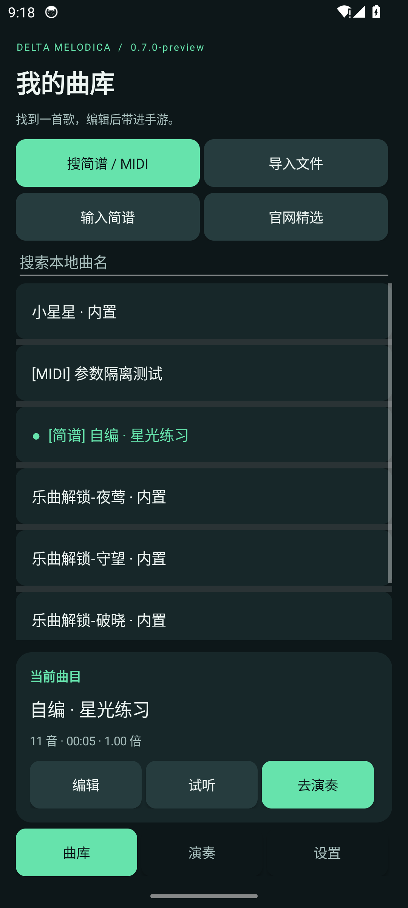
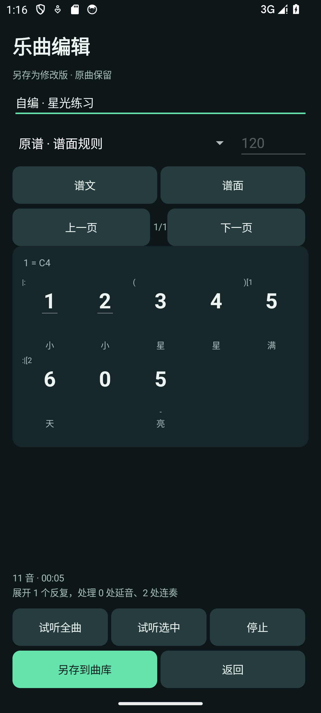
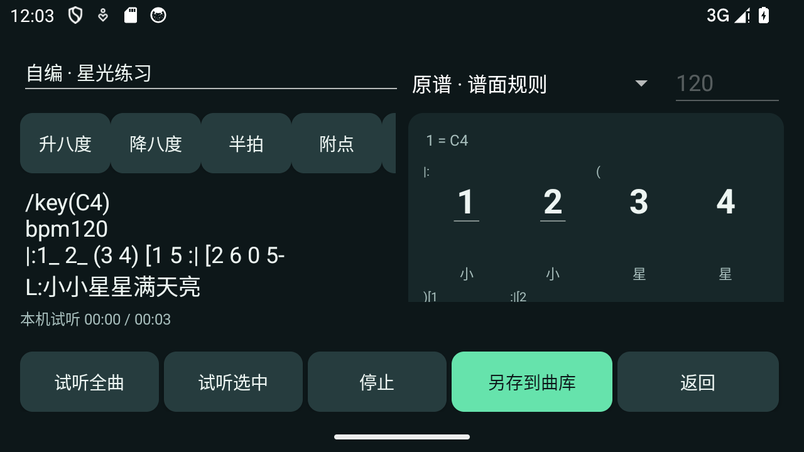
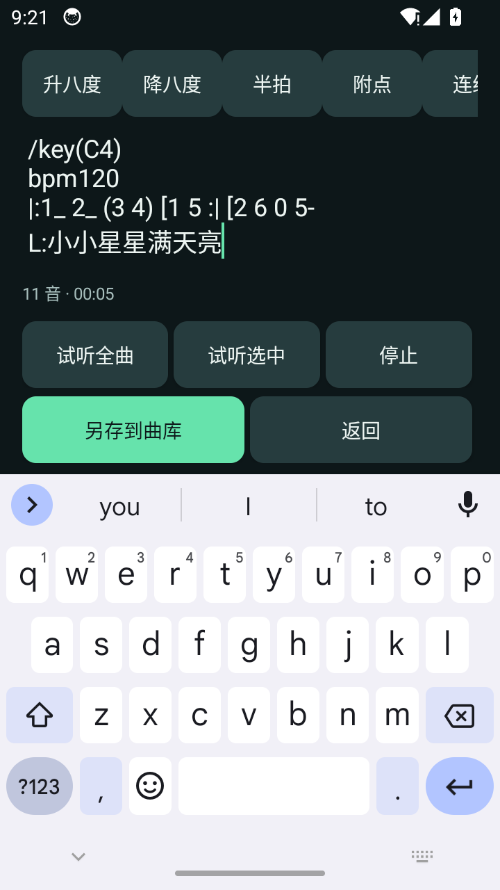

# 三角洲口风琴 · 安卓版

## v0.7.0 安卓功能整合

本版将遗漏的三页主界面、原谱编辑、试听、片段编排与正式版修复合并。曲库、演奏、设置分为三页，编辑页适配横屏与软键盘；保留五首内置曲目、账号隔离、JSON 下载和正式签名流程。新增检查更新、紧凑播放条及可展开悬浮曲库，进度定位后暂停并释放旧触摸，继续时提示半音设为未选中，3 秒后开始。

版本号为 0.7.0／11。本次整合不部署官网；官网历史发布版与本地整合包可能不同。分支核对及验证见 [整合审计](../docs/分支整合审计-20260919.md)。

## v0.6.3 半音纯文字提示（历史发布）

2026-09-14 已上线：[安卓官网下载](https://aiygzn.top/melodica/android.html)。本地成品为 `dist/delta-melodica-android-v0.6.3.apk`，沿用正式签名，可覆盖升级 v0.6.0 及以上正式包并保留曲库、设置与校准。公网下载及校验通过，详见[发布记录](../docs/android-v0.6.3-release.md)。

点击「播放」或「继续」后，小控制条内只短暂显示「半音设为未选中」。3 秒后文字自动换回播放进度并开始演奏，不再显示「开始演奏」「取消」或半音状态选择按钮，不弹窗、不展开额外提示区。准备期间不会发送音键或变音手势；需要中止时可点现有「暂停」「停止」，隐藏窗口或切出目标画面也会取消等待中的演奏。

28 项单元测试、15 项完整触摸回归及小屏大字体布局检查通过；仅使用 Android 14 模拟器自建键盘，未进行手游真机测试。

## v0.6.2 半音关闭提示（历史本地更新包）

本地更新包为 `dist/delta-melodica-android-v0.6.2.apk`，可覆盖升级 v0.6.0／v0.6.1 正式签名安装包。此阶段未发布到官网，以下交互已被 v0.6.3 替代。

播放和续播前不再选择「已选中／未选中」，统一提示「请先将游戏内『半音』设为未选中」。在游戏中手动关闭半音后，点「开始演奏」；不准备演奏时点「取消」。程序从半音关闭状态开始，随后按曲谱切换半音和音区。自适应悬浮窗与播放时自动精简继续保留。

28 项单元测试、15 项完整触摸回归通过。1280×720 小屏横屏、1.3 倍字体下的提示、真实点击开始、暂停／停止、拖动与边缘布局检查通过；使用独立 Android 14 模拟器自建键盘，未进行手游真机测试。

## v0.6.1 自适应悬浮控制条（历史本地更新包）

本地更新包为 `dist/delta-melodica-android-v0.6.1.apk`，沿用 v0.6.0 正式签名，可覆盖安装并保留曲库、设置与校准。此阶段未发布到官网，自适应悬浮窗已纳入 v0.6.3。

- 窗口不再固定长宽：宽度根据屏幕可用短边计算，高度随可见内容和系统字体自然撑开；旋转、显示密度和字体变化时重新布局。按钮保留至少 48dp 的点击面积，文字较大时优先保证操作完整。
- 倒计时与播放时自动变为单行控制条，仅显示倒计时／状态、时间进度、「暂停」「停止」与拖动区域；隐藏曲名、说明、「校准」「收起」。暂停、停止或结束并释放触摸后自动恢复完整操作。
- 按住控制条期间保持按钮位置，避免手势中断后展开导致误触。拖动时主动暂停，松手后恢复完整操作；靠近屏幕边缘展开会自动移回可见范围。
- 半音确认仍在播放／继续前显示；倒计时与播放中的收起保护继续有效。

28 项单元测试、15 项完整触摸回归，以及普通／小屏／大字体的悬浮布局检查通过；仅使用 Android 14 模拟器自建键盘，手游实际遮挡效果仍需真机确认。尺寸、截图和 APK 校验值见 [v0.6.1 验证记录](docs/悬浮控制条-v0.6.1.md)。


## v0.6.0 已正式上线

2026-09-14 用户确认真机试奏正常并授权发布。官网首屏和底部下载区已增加「下载 Android 版」，[安卓下载页](https://aiygzn.top/melodica/android.html)和[正式 APK](https://aiygzn.top/melodica/downloads/delta-melodica-android-v0.6.0.apk)均可访问。公开下载、签名及实际浏览器下载校验通过，完整记录见 [发布结果](../docs/android-v0.6.0-release.md)。

本版通过官网直接下载 APK，支持 Android 8.0+，包名 `top.aiygzn.melodica`，版本号 `0.6.0`／6。修复公开曲库 JSON 曲谱下载，保留 MIDI 校验、下载去重及离线演奏；新增离线「权限与数据说明」。账号服务于 2026-09-14 通过公开 HTTPS 健康检查，以下开发预览记录中的「尚待部署」为历史状态。

正式构建使用仓库外的独立 RSA 签名，不接受调试证书或可调试 APK。首次在本机生成签名后，所有后续正式版必须复用此密钥：

```powershell
.\init-signing.ps1 -JavaHome '你的 JDK 17 或更高版本目录'
.\build.ps1 -Configuration Release -WithDeviceTests -JavaHome '你的 JDK 17 或更高版本目录' -SdkRoot '你的 Android SDK 目录'
```

默认签名资料位于 `%LOCALAPPDATA%\DeltaMelodicaSigning\android`，密码以 Windows DPAPI 加密，仅当前 Windows 用户可解密。不要提交、发布或自动重建密钥；上线前需另外制作可信的加密备份，单独复制 `password.clixml` 到其他电脑不能恢复密码。官方签名说明见 [Android 文档](https://developer.android.com/studio/publish/app-signing)。

脚本清理构建后执行 Release 单元测试、Lint、APK 签名和不可调试检查，输出 `dist/delta-melodica-android-v0.6.0.apk`、SHA-256 文件和构建元数据。`-WithDeviceTests` 另外生成本地测试 APK，不混入交付目录。默认 Debug 构建输出 `delta-melodica-android-v0.6.0-preview.apk`，仅供开发测试。

旧 v0.5 等预览包与正式包签名不同，不能直接覆盖安装。先在旧包中同步曲库并在官网核对，或保留可重新导入的原始文件，再卸载旧包并安装正式包；本机设置和校准需重新配置。未同步且没有原始文件的曲谱不要先卸载。后续同签名正式版可以覆盖升级。此候选包的实测、发布材料和待确认项见 [上线准备记录](docs/上线准备-v0.6.0.md)。安卓源码现已纳入仓库；APK 上线仍单独执行。

## 历史开发记录

Android 8.0+，无需 Root。本版同步近期桌面版的搜索、编辑、原谱规则和曲目设置，并优化手机布局。

## 本版功能

- **三页导航**：曲库、演奏、设置。本地曲名筛选、来源标记、当前曲目卡片，以及搜索、导入、编辑和试听入口。竖屏单列，横屏并排，按钮随字体增高。
- **五来源聚合搜索**：简谱空间、官网曲库、BitMidi、MidiWorld、MidiShow，默认全选；支持繁简体匹配、逐站返回、加载更多、取消与源站浏览器入口。区分无结果、网络错误和人机验证。
- **全屏乐曲编辑**：MIDI、输入简谱、内置与云端曲谱均可编辑。精确音符／原谱格式、常用符号、调号、速度、移调、撤销／重做、全曲／选段试听与另存修改版。原曲保留，未保存返回时提示，旋转保留草稿和选区。默认先展示完整编辑页；点输入后收起说明区，给软键盘上方的谱文和保存按钮留出空间。搜索页也适配键盘。
- **原谱与谱面**：保留原文、歌词、来源和解析模式；点谱面定位文字。竖屏切换，横屏左右并排。试听按实际音频位置高亮和滚动，反复回到原音符；每页最多 128 个符号，支持手动与自动翻页。
- **每曲设置**：原谱分音／钢琴适配连奏，0.25～2 倍速、±24 半音移调，自动／指定／全部音轨。速度、移调、音轨、方式和片段按游客／账号分别保存；改参数会停止并回到曲首。
- **片段编排与定位**：按原曲秒数添加、更新、排序、删除、重复或清空。最多 100 段，每段重复 1～20 次。悬浮窗拖动进度后暂停并释放旧触摸，继续前提示半音设为未选中，3 秒后自动开始。
- **账号修正**：退出仍可查看原游客曲库，归属记录防止另一账号重复继承。合并时复制已有每曲设置，之后彼此独立。登录／注册／找回切换保留邮箱、清空密码和验证码；重置后返回登录页。
- **导入兼容**：MIDI、UTF-8 文本、桌面／官网曲谱 JSON，官网精选也支持 MIDI 与 JSON。原谱元数据与音符一致才恢复为原谱编辑，过期信息不覆盖实际音符。









## 使用

1. 安装 APK，打开「三角洲口风琴」，首次点击「开启无障碍服务」，阅读说明并前往系统设置，开启「三角洲口风琴 · 演奏服务」。返回应用后会自动刷新授权和连接状态。尚未开启时，点击「显示悬浮控制条」也会直接给出申请入口。
2. 选择内置《小星星》或四首「乐曲解锁」曲目，或点击「线上曲库」搜索、分页浏览官网 MIDI；也可点击「搜简谱 / MIDI」同时搜索简谱空间、官网曲库、BitMidi、MidiWorld 和 MidiShow。可下载的结果点选后会校验并加入本地曲库，MidiShow 等需登录或积分的结果可打开源网页，下载后通过「导入已下载 MIDI」接入。也可导入 `.mid`／`.midi`、UTF-8 文本简谱，或直接输入简谱保存。MIDI 可选择自动旋律、指定音轨或全部音轨高声部。
3. 设置速度和移调，点击「显示悬浮控制条」。进入三角洲手游的口风琴演奏画面。
4. 点悬浮窗「展开」，再点「校准」，依次点 **1、2、3、4、5、6、7、高音 1、半音、升调、自然音、降调** 的中心，共 12 处。校准层只记录位置，不会将这些点击传给游戏。校准同时绑定当前应用、屏幕尺寸和旋转方向。
5. 将悬浮窗拖到不遮挡这 12 个按钮的位置。点「播放」后会短暂提示将游戏内「半音」设为未选中，3 秒后提示消失并自动开始。「暂停」保留位置；「继续」也会提示 3 秒，随后自动从原位置续播；「停止」回到曲首。每次播放／继续前先关闭半音，提示期间也可手动关闭；不需要再次确认。
6. 小控制条保留播放／暂停和展开入口，停止位于展开后的详情窗；展开后可选曲、定位进度和校准。拖动会暂停，移到合适位置后点「继续」。结束时在设置页停止并隐藏悬浮窗，下次可重新显示；关闭授权需进入系统无障碍设置。

已有曲库和 v0.2 以后的 12 点校准可继续使用。屏幕方向、分辨率、键位或目标应用改变后重新校准。「设置 → 打开本地测试键盘」可检查触摸，测试键盘校准不会用于游戏。

## 记谱与当前范围

精确格式以空格分隔，冒号后为拍数，支持分数／小数，重复加减号表示多个八度：

    1 2 3:2 0 +1 -5 #4
    (1 1 2) 0:1/2 ++1

MIDI 转换以 120 BPM 表示精确拍数，保留变速、长音和休止；括号只表示连奏，重复音独立起音，时间精度为毫秒。

## 聚合搜索

- 「搜简谱 / MIDI」默认勾选与 Windows 端相同的五个来源；每个来源独立并行返回，单站失败、人机验证或网络较慢不会阻塞其他结果。
- 结果按来源去重，可按需取消来源，支持繁简体曲名匹配和「加载更多」。简谱空间结果直接读取网页简谱并转换；官网曲库保留 JSON／MIDI 校验；BitMidi、MidiWorld 下载公开 MIDI；MidiShow 只打开源网页，不代替用户登录或处理积分。
- 搜索或下载期间返回主界面不会让旧请求覆盖当前选曲；聚合下载使用稳定本地标识，重复选用不会产生重复曲目。网页结果仍受源站限流、验证和页面结构变化影响。

## 音高和时序范围

- 默认中央 1 = MIDI 60（C4），需按游戏实际音高校正。
- 升调、自然音、降调是点击后保持选中的三选一音区；半音是独立开关，可以与任意音区组合。自然音只切回中央音区，不会取消半音。
- 沿用音高映射：升调高一个八度、降调低一个八度、半音升半音，超出总音域的音按八度折回。程序先松开音键，再依次点击需要改变的音区／半音按钮，最后按住音键；状态相同时不重复点击。
- 每次开始、续播都短暂提示用户将游戏内半音设为未选中，3 秒后提示自动消失并按半音关闭的初态演奏。提示期间不会发出音键／变音手势，也不会读取或自动关闭游戏半音。暂停、停止、隐藏悬浮窗、切出或旋转会取消待开始的演奏；播放中的手动变音调整前请先暂停。
- v0.6.3 的准备阶段留给用户关闭半音，首音变音在提示结束后切换。休止符及上一音符松键后的提前变音继续保留；只有切换超过下一音符的开始时刻才暂缓乐谱计时，避免吞掉短音。先松开音键才切换，也不会提前按下下一音符。
- 变音按钮每次点击仍为 45 毫秒，点击间隔和结束等待缩短至 8 毫秒；需要同时改变音区和半音时，将两次先后点击放在同一手势批次，减少系统回调往返。实际耗时仍受系统调度影响。频繁变音且没有足够空隙的曲目仍可能长于曲谱显示时长，不能保证零停顿。
- 开始／继续前缓存音符指法，悬浮窗仅在文字和按钮状态改变时更新，减少演奏期间的重复计算与布局。
- 简谱支持 `1 2 3:2 0 +1 -5 #4`；冒号后为拍数，支持 `:1/2`，文本文件默认 100 BPM。
- MIDI 支持 PPQ 时间格式的 0／1 型、跨轨速度表、打击乐过滤与高声部整理；不支持 SMPTE、类型 2、踏板还原和完整多声部。尚未完整移植桌面版的钢琴连奏和片段编排。
- 调速和移调在主界面设置，应用后回到曲首。悬浮窗提供播放、暂停、继续、停止、校准和收起。
- 曲谱最长 30 分钟、最多 30000 音符，MIDI 文件最大 10 MB。导入保存本地副本，不修改原文件。

支持八度点、升降音、附点、减时符号、延音、小节、反复、一二房子、段落调号及歌词相对转调。未标速度部分按 120 BPM，未标调号部分按 1=C4，并提示默认值。

反复最多嵌套 8 层，回跳恢复段首速度、调号、歌词转调，一房子的变化不带入第二遍。同音圆括号／波浪延音线合并为一次起音，不同音高圆括号按连奏处理。选段从完整时间轴裁切，保留上下文和反复中的各次出现，须选中完整音符。

「跟随源站播放」沿用桌面已核对的差异：忽略反复与连线，最后一个调号用于全曲，房子数字可能成为音符。两种模式独立保存。暂不支持 D.C.／D.S.、更多房子、专用连音组、装饰音及跨反复边界连线，未知语法阻止导入。

谱面是辅助编辑预览，结构标记使用紧凑文字，尚非印刷级制谱，不支持拖拽音符。图片／PDF 简谱识别、音频自动扒谱未包含在此版。

## 网络与数据

公开 MIDI／文字谱可下载；MidiShow 在浏览器验证并按源站账号／积分规则下载后导入。程序不代登录或自动完成人机验证。

网页最大 2 MB，官网目录 1 MB、5000 首，MIDI 10 MB，官网 JSON 2 MB。仅接受 HTTPS，限制超时和重定向，校验目录提供的大小与 SHA-256 后才保存。同一官网下载固定标识，聚合 MIDI 按内容摘要去重，简谱按来源、原文和模式保存。退出或新搜索使旧回调失效，失败不留下半首曲目。

游客可离线导入、编辑、试听、演奏。注册继承／主动同步才上传私有云端，账号与官网、Windows 共用；会话用 Android Keystore 加密，密码不落盘。云端仅同步标准音符、时值和音轨，原文、局部连奏、速度、移调、片段和校准留在本机。卸载移除本机数据，云端曲库保留。

## 输入保护

只在校准目标应用处于前台、屏幕解锁且尺寸／方向一致时发手势；切出、锁屏、旋转或系统取消手势时暂停并作废变音状态。先释放音键，再切换音区／半音，再按音键，相同已知状态不重复切换。

升调／自然音／降调三选一，半音独立。中央 1 默认 MIDI 60，超音域仅按八度折回。手动改变音前应暂停。长音按不超过 60 毫秒的片段续接，实际释放延迟受系统调度影响；接口拒绝或超时则关闭服务，由系统清理触摸。

保留倒计时及空隙提前变音；切换超过下一音时刻时暂缓乐谱时钟，避免吞短音，密集变音可能长于显示时长。曲谱／编排仍限 30 分钟、30000 音符。MIDI 支持 PPQ 0／1 型、跨轨速度和打击乐过滤，不支持 SMPTE、类型 2、踏板还原或完整多声部。

不读取游戏文字、不截图游戏、不读写游戏进程。验证截图来自专用模拟器自建界面；模拟器通过不代替手游真机验证。

## 构建与验证

使用 JDK 17 或更高版本，安装 Android SDK Platform 34 与 Build Tools 36.0.0。设置 `JAVA_HOME` 和 `ANDROID_HOME`，或在本目录不入库的 `local.properties` 中指定 `sdk.dir`。

```powershell
.\build.ps1 -JavaHome '你的 JDK 17 或更高版本目录' -SdkRoot '你的 Android SDK 目录'
```

默认 Debug 构建输出 `dist/delta-melodica-android-v0.7.0-preview.apk`。正式包使用 `-Configuration Release`，输出 `dist/delta-melodica-android-v0.7.0.apk`、SHA-256 和构建元数据，复用既有仓库外正式签名。脚本执行清理、单元测试、Lint 和构建；Release 额外检查签名及不可调试状态。

账号测试入口为 AccountChecks，使用隔离目录及假服务、不发邮件。默认 GestureSmokeTest 需要专用设备预先开启本应用无障碍，支持 suite=permissions、online、timing；切换入口后重新安装测试 APK。成功须有各项通过和 INSTRUMENTATION_CODE: -1，不能只看 adb 返回码。

设备触摸回归需要专用 Android 10+ 测试设备或模拟器，先安装应用并开启本应用的无障碍服务：

```powershell
.\gradlew.bat assembleDebugAndroidTest
adb -s 你的测试设备序列号 install -r .\app\build\outputs\apk\androidTest\debug\app-debug-androidTest.apk
adb -s 你的测试设备序列号 shell am instrument -w -r top.aiygzn.melodica.test/top.aiygzn.melodica.GestureSmokeTest
# 记录实际 DOWN／UP 时间，检查休止时不累积切换延迟、音符不提前及二倍速密集变音
adb -s 你的测试设备序列号 shell am instrument -w -r -e suite timing top.aiygzn.melodica.test/top.aiygzn.melodica.GestureSmokeTest
# 专用测试设备上的授权保留、重开应用、连接状态和按需申请验证
adb -s 你的测试设备序列号 shell am instrument -w -r -e suite permissions top.aiygzn.melodica.test/top.aiygzn.melodica.GestureSmokeTest
# 悬浮窗自适应、半音确认、真实暂停／停止、拖动与边界验证；可在不同尺寸及字体设置下重复执行
adb -s 你的测试设备序列号 shell am instrument -w -r -e suite overlay top.aiygzn.melodica.test/top.aiygzn.melodica.GestureSmokeTest
# 线上曲库验证，不要求开启无障碍演奏服务；会读取官网并验证当前目录中的 MIDI
adb -s 你的测试设备序列号 shell am instrument -w -r -e suite online top.aiygzn.melodica.test/top.aiygzn.melodica.GestureSmokeTest
```

此入口会打开应用自建测试键盘，临时校准并执行触摸，结束后恢复曲库选择和校准设置。它不会进入三角洲手游；只重连原本已开启的本应用无障碍服务。成功时输出各项「通过」和 `INSTRUMENTATION_CODE: -1`；仅 adb 返回码为 0 不能判断测试成功。普通 `uiautomator dump` 会暂时抑制其他无障碍服务，不应在演奏过程中用它验证状态。

15 项触摸设备回归包含真实 12 点校准、变音与播放生命周期、倒计时预选变音但不发音，以及倒计时／演奏时收起禁用、结束／暂停／停止后恢复、实际点击禁用按钮不收起。时序入口另有 2 项检查和 3 段计时记录。线上曲库另有 5 项设备验证，覆盖官网目录和 MIDI 下载、搜索分页、取消／下载／返回主界面、重复选用、加载期间关闭页面。测试入口会清理本次创建的测试下载，保存自建界面截图；正常演奏不截图。

授权入口有 5 项检查：停止隐藏保持系统开关、恢复悬浮窗及退出重开不重复申请、已授权但未连接的状态展示、管理授权的系统 Intent、撤销后按需申请。仅设备测试包临时操作专用设备设置并在结束时恢复；正式 APK 不包含测试入口，也不具备自动修改系统无障碍开关的能力。该入口的 Intent 拦截验证不代替各手机系统的设置页面实测。


## 平台接口依据

- [Android 无障碍手势接口](https://developer.android.com/reference/android/accessibilityservice/AccessibilityService#dispatchGesture(android.accessibilityservice.GestureDescription,android.accessibilityservice.AccessibilityService.GestureResultCallback,android.os.Handler))
- [连续长按手势](https://developer.android.com/reference/android/accessibilityservice/GestureDescription.StrokeDescription#continueStroke(android.graphics.Path,long,long,boolean))
- [无障碍悬浮窗](https://developer.android.com/reference/android/view/WindowManager.LayoutParams#TYPE_ACCESSIBILITY_OVERLAY)

真机待验证：手游对按钮点击时长及切换间隔的响应、中央音高和八度映射、长音听感、密集音符稳定性，以及不同手机系统的后台行为。选中与互斥规则按用户提供的手游画面和说明实现。
