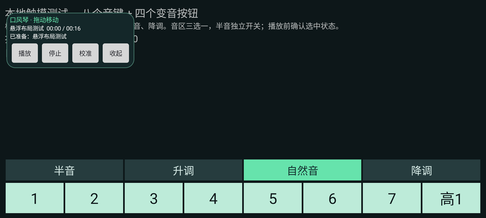
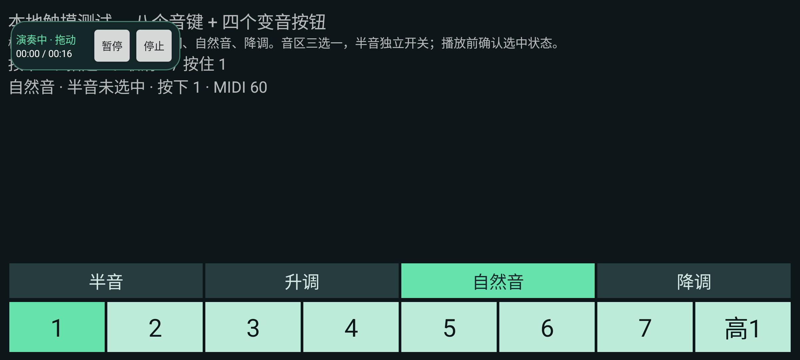
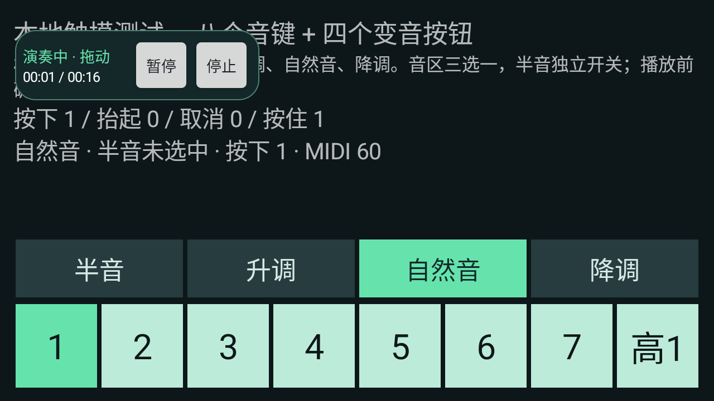
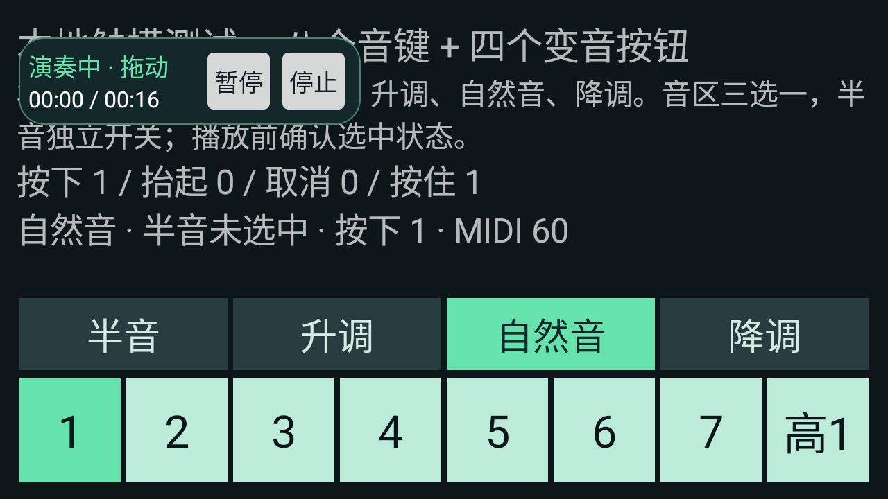
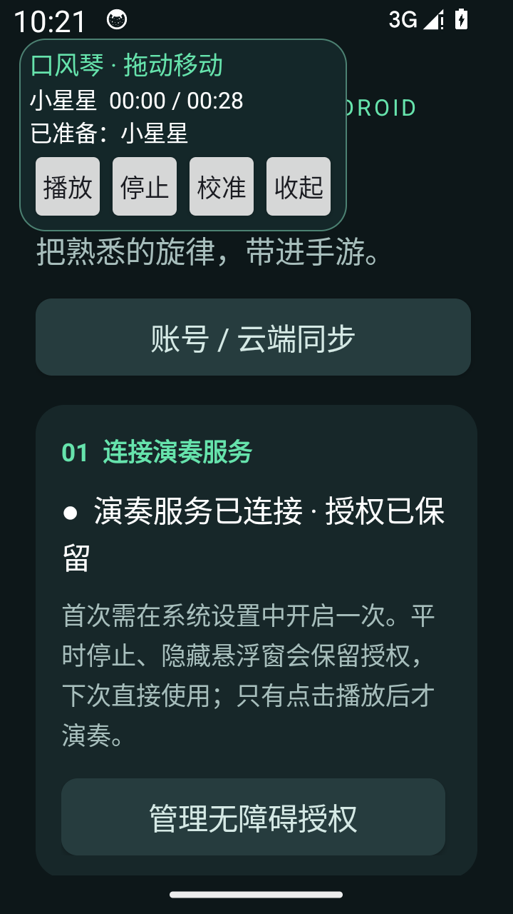

# 安卓 v0.6.1 悬浮控制条验证

2026-09-14，按用户要求缩小手游悬浮框，并取消固定长宽。本地更新包采用 v0.6.0 的正式证书，官网安装包未替换。

## 行为

- 普通状态以可用屏幕短边的 62% 为期望宽度，播放状态为 50%；按字体实测宽度与按钮点击面积确定下限，并限制在可用屏幕宽度以内。高度使用内容自适应，48dp 仅为按钮及拖动区域的最小点击高度。
- 倒计时和播放使用紧凑控制条，保留倒计时／状态、时间进度、暂停、停止和拖动；隐藏曲名、说明、校准和收起。触摸释放后，暂停、停止与结束自动恢复完整操作。
- 手指按住时保持布局，拖动主动暂停。靠边展开会重新限制位置，字体、密度及方向变化会重建布局。
- 半音确认区收起并完成实际布局后再检查音键遮挡，避免小屏大字体使用旧高度误报。停止、隐藏、画面变化及下一次确认会使旧回调失效。

## 已执行验证

构建命令：

```powershell
.\android\build.ps1 -Configuration Release -WithDeviceTests -JavaHome 'D:\Program Files\Android\Android Studio\jbr' -SdkRoot 'D:\Android\Sdk'
```

- 干净源码提交 `82f6ff69165a7b2af7172ec0cfec3f94974032fd`，28 项 Release 单元测试通过，Lint 为 0 错误、25 警告，签名及不可调试检查通过。
- 最终 APK 的完整 `GestureSmokeTest` 15 项通过，返回 `INSTRUMENTATION_CODE: -1`，覆盖真实 12 点校准、半音确认、倒计时、重复音／长音、变音、暂停续播、真实停止归零、校准窗口和旋转检查、切出暂停。模拟器回读的已安装 APK 与交付 APK 的 SHA-256 一致。
- 独立 Android 14 / API 34 模拟器，自建键盘；`GestureSmokeTest -e suite overlay` 检查真实暂停／停止、暂停释放和停止归零、播放中长按拖动、边缘展开、最小点击面积、进度文字完整、半音确认与布局等待期间取消。
- 下表为测得的物理像素尺寸，不是程序中的固定配置。各场景均返回 `INSTRUMENTATION_CODE: -1`，已查看普通、播放、小屏、大字体及靠边截图。

| 屏幕 | 密度 | 系统字体 | 普通状态 | 播放状态 | 播放占普通面积 |
| --- | --- | --- | --- | --- | --- |
| 2400×1080 横屏 | 2.625 | 1.0 | 631×274 | 509×148 | 43.6% |
| 1280×720 小屏横屏 | 2.25 | 1.0 | 460×236 | 438×126 | 50.8% |
| 1280×720 小屏横屏 | 2.25 | 1.3 | 460×270 | 493×126 | 50.0% |

大字体时允许增加宽度以容纳进度与按钮，仍通过减少高度显著缩小遮挡。测试键盘固定横屏；改变设备默认旋转设置不会使该测试变为竖屏，以上结果均按实际横屏记录。

另在 720×1280 竖屏、密度 2.25、1.3 倍字体的主界面查看实际悬浮窗：文字和四个操作按钮完整，窗口位于可见屏幕内。竖屏检查仅验证显示，未向主界面发送演奏手势。设备测试结束会终止目标进程，截图前仅在此专用模拟器重新连接原已授权服务。

开发期间发现并修复两项问题：长按拖动可能被后续演奏手势打断；半音确认收起后使用旧尺寸导致大字体场景误报遮挡。原失败日志保留在 `work/android/compact-*-result.txt`，修复后的相关场景均通过。测试断言改为传回测试线程，失败时也能恢复设置并输出报告。

## 本地成品

- 文件：`dist/delta-melodica-android-v0.6.1.apk`，70,156 字节，版本 `0.6.1`／7。
- SHA-256：`9474a9c5284ea8c99646eb04ba77b3093ff756f906fd0caf9deba05cb09682df`。
- 证书 SHA-256：`fbb496e1dfe34cbaefe4e07fc6ab82480ca1b52807c5d86ac7fa49aa1231154c`，与 v0.6.0 正式版一致，可覆盖升级。
- 未连接真实手机，未进入手游；本记录不将模拟器触摸及截图等同于手游实际显示或听感验证。










