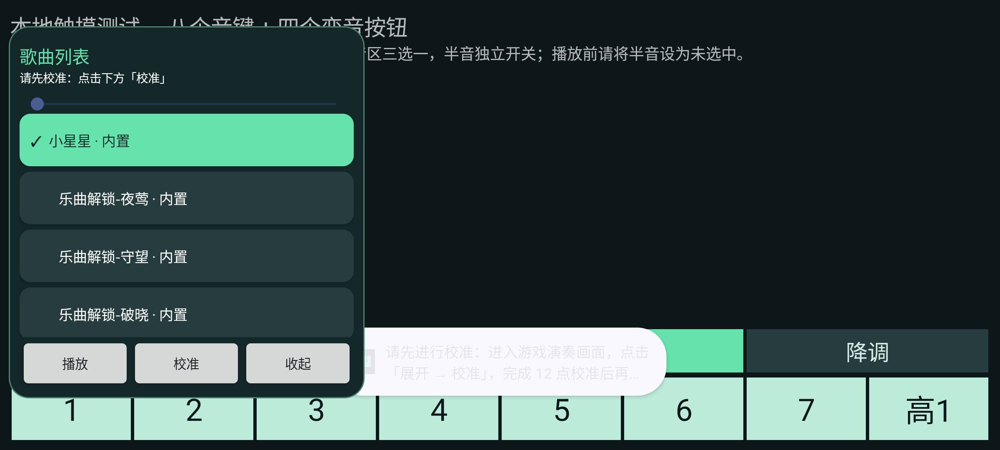

# 安卓 0.7.2：播放前校准提示

未完成校准时，原先主要依赖系统短消息提示，悬浮条仍显示时间，详情窗会被收起，用户容易误以为点击无响应。

现在紧凑条持续显示“请先校准”；点击播放提示先进入游戏，通过“展开 → 校准”完成 12 点校准。详情窗显示“请先校准：点击下方「校准」”，点击播放保留当前窗口和校准入口。校准进行中或未加载曲目时也给出明确提示。

版本为 0.7.2（versionCode 13），保留 0.7.1 快速切调方案，默认仍为稳定模式。官网发布独立进行。

## 验证

- Gradle 单元测试、Debug 应用和设备测试包构建通过。
- 隔离模拟器、自建触摸键盘：真实点击两个悬浮窗的播放按钮，断言提示文字可见、详情窗未收起、未倒计时且未发送音键或变音手势。
- 完成真实 12 点校准后执行完整演奏回归，覆盖播放、暂停、停止、定位、切调、目标窗口与旋转检查。
- 提示截图已人工检查，校准指引及按钮完整显示。

回退行为时可先保留不播放，修复代码需使用更高版本号、相同签名发布；不要通过卸载回退，以免丢失本地数据。
